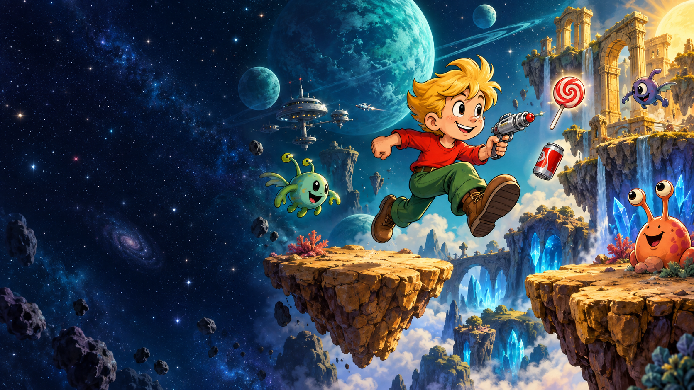

# Little Willy — Back on Earth II



A modern browser remaster of **Little Willy v1.1**, the DOS platform game created by I. Mustun / Dimension 16 and M.B. Soft in 1993–1994.

The original 24 maps, world themes and level geometry return with high-resolution cartoon artwork, modern controls, shooting, music, touch support and adjustable difficulty.

**Current version: 2.12.2** · [Play Little Willy](https://little-willy.netlify.app/)

## Highlights

- All 24 original worlds and the Earth II space station
- High-resolution environments, animated Willy and remastered enemies
- A different recorded soundtrack for each world theme, with music volume control
- Keyboard, touch and installable web-app support
- Easy, Medium and Hard difficulty
- Optional God Mode and checkpoints
- More forgiving steering into narrow passages on phones
- One hidden bonus heart in every world
- Personal high scores and completed-world markers stored on the device
- Shareable completion screen after each finished world

## How to play

Find the **EXIT card**, then reach the EXIT door. Cans and lollipops are optional and award **100 points each**. Green, red and yellow keys open locks of the matching colour.

| Control | Action |
| --- | --- |
| `←` / `→` or `A` / `D` | Move |
| `Space` | Jump; hold it for a higher jump |
| `↓` | Drop through thin platforms and enter narrow shafts more easily |
| `S` / `J` | Shoot |
| `↑` / `W` | Enter a door or use the EXIT |
| `C` | Save an enabled checkpoint on safe ground |
| `G` | Toggle God Mode |
| `M` | Toggle music |
| `Esc` | Pause |

Touch controls appear automatically on phones and tablets. Landscape orientation is recommended.

## Difficulty and health

| Mode | Starting health | Enemy speed |
| --- | ---: | ---: |
| Easy | 6 hearts | 75% |
| Medium | 4 hearts | 100% |
| Hard | 3 hearts | 120% |

Hazards and enemy contact remove one heart and give Willy a short recovery period. A moving bonus heart adds one health point. God Mode remains available at every difficulty and makes Willy invincible; the EXIT card and matching keys are still part of the adventure.

Runs using Easy difficulty, God Mode or checkpoints are recorded separately as assisted high scores.

## Web app and offline play

The site can be installed from a supported browser with **Install App**. This creates a Progressive Web App that opens like a standalone application and can use cached files offline. It is separate from the native Android APK.

Progress, settings and scores are stored locally in the current browser. They do not automatically transfer between browsers or devices.

## Run locally

No build step, framework, database or server-side code is required. Serve the repository root with any static web server:

```bash
python -m http.server 8080
```

Then open <http://localhost:8080/>. Opening `index.html` directly may prevent service-worker and audio features from working correctly.

## Deploy to Netlify

This repository is ready for Netlify. `netlify.toml` publishes the repository root and `_headers` supplies the required cache and security headers. Connect the repository to Netlify or drag the complete web ZIP into Netlify Drop.

See [HOSTING.txt](HOSTING.txt) for update and cache instructions. Release history is in [CHANGELOG.md](CHANGELOG.md).

## Main files

| Path | Purpose |
| --- | --- |
| `index.html` | Game shell and interface |
| `engine-v2.js` | Platforming, collision, items, enemies and level state |
| `game-v2.js` | Controls, audio, menus, progress and game flow |
| `renderer.js`, `modern-art.js` | Modern visual rendering and animation |
| `levels.js` | Imported original maps and entities |
| `soundtrack.js`, `music-*.mp3` | World soundtrack selection and music files |
| `assets/`, `original/` | Preserved original graphics and DOS game data |
| `service-worker.js` | Offline cache for the installable web app |

## Credits

Based on the original game by **I. Mustun / Dimension 16 and M.B. Soft**. The remaster preserves the original level layouts while presenting them with new artwork, music and accessibility options.
